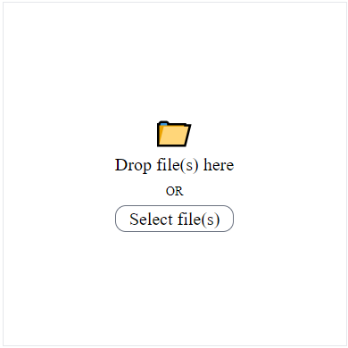

# vue3-drop-file-upload

English｜[繁體中文](https://github.com/LaiJunBin/vue3-drop-file-upload/blob/main/README.zh-tw.md#vue3-drop-file-upload)

The package implements simple drop file upload, based on Tailwind CSS.

[Demo Link](https://laijunbin.github.io/vue3-drop-file-upload)

---

## Demo Image


---

## Install

```
$ npm install vue3-drop-file-upload
```

---

## Usage

```html
<script setup lang="ts">
import TheDropFileUpload from "vue3-drop-file-upload";

const onUpload = (files: FileList) => {
  console.log(files);
};
</script>

<template>
  <TheDropFileUpload
    @upload="onUpload"
    class="w-96 h-96 border border-solid border-gray-200 mx-auto mt-4 flex items-center justify-center"
  >
  </TheDropFileUpload>
</template>
```

---

## Property & Function Description
    
`TheDropFileUpload` component available properties:
Type  | Data Type  | Name           | Description  |
-----|----------------|-----|---|
Property | String | class    | Set init class. |
Property | String | enterClass    | Set class, when dragenter event trigger. |
Property | Boolean | multiple    | Set whether to support multiple file selection |
Property | Boolean | dropOnly    | Set whether to support drag&drop upload only. |
Event | Function | upload(files: FileList)    | When the file change will trigger the event. |

`TheDropFileUpload` component available function:
Name       | Description   |
----------------|----------|
selectFile       | Call the native select file window, which still dispatches an upload event when a file is changed. |

## Customize Content (slot)
Name  |  Description  |
-----|----|
default | Replace all content. |
icon | Replace icon only. |
text |  Replace text only. |

---

## Customize Example



## Code

```html
<script setup lang="ts">
import { ref } from "vue";
import TheDropFileUpload from "vue3-drop-file-upload";

const dropFileUpload = ref<InstanceType<typeof TheDropFileUpload> | null>(null);
const onUpload = (files: FileList) => {
  console.log(files);
};
</script>

<template>
  <TheDropFileUpload
    @upload="onUpload"
    class="w-96 h-96 border border-solid border-gray-200 mx-auto mt-4 flex items-center justify-center"
    ref="dropFileUpload"
  >
    <template #text>
      <div>Drop file(s) here</div>
      <small class="text-sm">OR</small>
      <div
        class="relative mt-1 border border-solid border-gray-500 rounded-xl z-50 cursor-pointer select-none"
        @click="dropFileUpload?.selectFile"
      >
        Select file(s)
      </div>
    </template>
  </TheDropFileUpload>
</template>
```