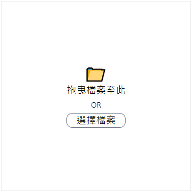

# vue3-drop-file-upload

[English](https://github.com/LaiJunBin/vue3-drop-file-upload#vue3-drop-file-upload)｜繁體中文


這是一個基於 Tailwind CSS 的簡易的拖放上傳檔案的套件。

[Demo 連結](https://laijunbin.github.io/vue3-drop-file-upload)

---

## Demo 圖片


---

## 安裝

```
$ npm install vue3-drop-file-upload
```

---

## 使用

```html
<script setup lang="ts">
import TheDropFileUpload from "vue3-drop-file-upload";

const onUpload = (files: FileList) => {
  console.log(files);
};
</script>

<template>
  <TheDropFileUpload
    @upload="onUpload"
    class="w-96 h-96 border border-solid border-gray-200 mx-auto mt-4 flex items-center justify-center"
  >
  </TheDropFileUpload>
</template>
```

---

## 屬性 & 方法 說明
    
`TheDropFileUpload` 組件可用的屬性：
類型  | 型別  | 名稱           | 描述  |
-----|----------------|-----|---|
屬性 | String | class    | 設定class |
屬性 | String | enterClass    | 設定當 dragenter 要設定的 class |
屬性 | Boolean | multiple    | 是否支援選擇多個檔案 |
屬性 | Boolean | dropOnly    | 是否只支援拖放上傳 |
事件 | Function | upload(files: FileList)    | 當有檔案被選取會觸發的事件 |

`TheDropFileUpload` 組件提供的方法：
名稱       | 描述   |
----------------|----------|
selectFile       | 呼叫原生的選擇檔案視窗，選取後一樣會觸發 upload 事件 |
clearFile        | 清除 file input 的 value

## 客製化內容 (slot)
名稱  |  描述  |
-----|----|
default | 替換整個內容 |
icon | 僅替換 icon |
text |  僅替換文字 |

---

## 客製化範例



## 程式碼

```html
<script setup lang="ts">
import { ref } from "vue";
import TheDropFileUpload from "vue3-drop-file-upload";

const dropFileUpload = ref<InstanceType<typeof TheDropFileUpload> | null>(null);
const onUpload = (files: FileList) => {
  console.log(files);
};
</script>

<template>
  <TheDropFileUpload
    @upload="onUpload"
    class="w-96 h-96 border border-solid border-gray-200 mx-auto mt-4 flex items-center justify-center"
    ref="dropFileUpload"
  >
    <template #text>
      <div>拖曳檔案至此</div>
      <small class="text-sm">OR</small>
      <div
        class="relative mt-1 border border-solid border-gray-500 rounded-xl z-50 cursor-pointer select-none"
        @click="dropFileUpload?.selectFile"
      >
        選擇檔案
      </div>
    </template>
  </TheDropFileUpload>
</template>
```

---

## 樣式 CSP(Content Security Policy) 說明
如果你的網站有設定 CSP，你需要加入以下的設定：

```html
    <meta property="csp-nonce" content="<your-nonce>" />
```

之後自動注入的 style 標籤會加入 `nonce` 屬性。
